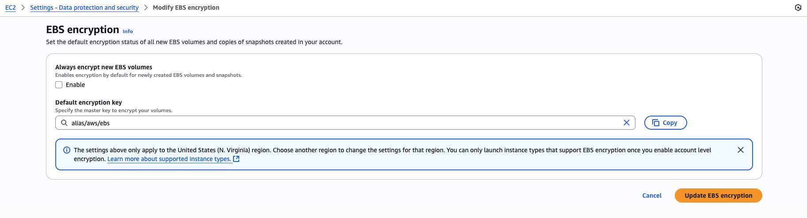

# Goal: Encrypt New EBS Volumes by Default

- **Scope**: Internal AWS account, Region: `us-east-1`
- **Key**: Default AWS-managed key `aws/ebs`

## Step 1: Enable Default EBS Encryption

### Why:

Enabling default encryption ensures that **any new EBS volume** created in `us-east-1` is automatically encrypted using the AWS-managed key aws/ebs, with **no developer action needed**. This is a preventive security control.

### AWS Console (UI) Instructions:

- Go to **Services → EC2**.
- In the **left sidebar**, scroll down to **Settings** → Click **EBS encryption**.
- Click the **Manage** button.
- On **Always encrypt new EBS volumes** Check the box **Enable** .
- Leave the selected KMS key as the default: `alias/aws/ebs`.
- Click **Update EBS Encryption**.



=> ✅ Default encryption is now enabled for the region.

### AWS CLI Equivalent:

```bash
aws ec2 enable-ebs-encryption-by-default --region us-east-1
```

Then verify:

```bash
aws ec2 get-ebs-encryption-by-default --region us-east-1
```

Expected output:

```json
{
  "EbsEncryptionByDefault": true
}
```

## Step2: Verify with a Test EC2 Launch

### Why:

This validates that the encryption setting is working as expected. We'll launch a test instance and inspect the root volume to confirm it is encrypted.

### AWS Console (UI) Instructions:

- In EC2 dashboard, click **Launch Instance**.
- Name the instance, choose the AMI, and Instance Type.
- In the **“Storage”** section You should see:
  - Size (e.g., 8 GiB)
  - **Encryption: Enabled**
  - **KMS Key: aws/ebs**
- Click Launch Instance.

✅ Once launched, go to Elastic Block Store → Volumes and:

- Look for the volume attached to your instance.
- In the “Encrypted” column, confirm it says Yes

## Step 3: Check EC2 Launch Templates

### Why:

Even if default encryption is enabled, if a **Launch Template** explicitly disables encryption, it will override your default setting. You need to check and correct this if used in Auto Scaling Groups, Beanstalk, etc.

### AWS Console (UI) Instructions

- Go to **EC2** → **Launch Templates**.
- Click on **each Launch Template** in the list.
- Open the **latest version** → Expand **“Storage (Block device mappings)”**.
- Look for:
  - Encryption: Yes → ✅ Good
  - Encryption: No → ❌ Needs update. To fix:
    - Click **Actions** → **Modify Template (Create New Version)**.
    - In **“Storage”** section, **ensure encryption is enabled or left blank**.
    - Save as new version and **set is as default**.

## Step 4: Documentation

### Why

Document the change for compliance, auditing, and future reference.

| Item                     | Value                                 |
| ------------------------ | ------------------------------------- |
| Region                   | us-east-1                             |
| Account                  | Internal                              |
| Date Enabled             | 2025-07-27                            |
| Enabled By               | XXXXXXXXX                             |
| Encryption Status        | Enabled                               |
| KMS Key Used             | aws/ebs                               |
| Verification             | Test EC2 volume → Encrypted = Yes     |
| Launch Templates Checked | Template-A (OK), Template-B (Updated) |

## Summary:

| Step | What                          | Console (UI)                        | CLI                                        |
| ---- | ----------------------------- | ----------------------------------- | ------------------------------------------ |
| 1    | Enable default EBS encryption | EC2 → Settings → EBS Encryption     | `aws ec2 enable-ebs-encryption-by-default` |
| 2    | Verify with test EC2 launch   | Launch instance → Check root volume | Launch → `describe-volumes`                |
| 3    | Review launch templates       | EC2 → Launch Templates              | `describe-launch-template-versions`        |
| 4    | Document the change           | Internal doc                        | N/A                                        |

## Automation

- Terraform automation to encrypt the default new ebs encryption + for the launch tempaltes if available

# Goal: Treating Existing (Old) Unencrypted EBS Volumes

## Why this is important

EBS encryption is **not retroactive**, enabling default encryption only affects new volumes. So to be fully compliant with the task "All EBS Volumes are encrypted", we must also:

- Find existing unencrypted volumes
- Encrypt them (via snapshot copy + volume replacement)

## Strategy to Encrypt Existing Volumes

- Step 1: Identify Unencrypted Volumes
- Step 2: Encrypt the Volumes (Manual or Scripted)

## Step 1: Identify Unencrypted Volumes

### AWS Console (UI)

- Go to **EC2 → Volumes**.
- Use the **filter** at the top:
- Select **“Encrypted: false”**
- This shows all unencrypted volumes in us-east-1.

### AWS CLI

```bash
aws ec2 describe-volumes \
  --filters Name=encrypted,Values=false \
  --region us-east-1 \
  --query 'Volumes[*].{ID:VolumeId,AZ:AvailabilityZone,State:State,Instance:Attachments[0].InstanceId}' \
  --output table
```

## Step 2: Encrypt the Volumes (Manual or Scripted)

### How ?

- Encryption requires:
  - Snapshot of original volume
  - Encrypted copy of snapshot
  - New volume from encrypted snapshot
  - Swap the old volume for the new one (may require instance stop/start)

NOTEs:

- We cannot encrypt an existing EBS volume in place.
- Encryption requires creating a new volume from an encrypted snapshot of the original.
- You can't enable encryption by modifying a volume. Instead, create a snapshot, copy it with encryption enabled, and then create a new volume from the encrypted snapshot.
- AWS Docs: https://docs.aws.amazon.com/ebs/latest/userguide/ebs-encryption.html

### Manual UI Method (Per Volume):

- Select **unencrypted volume → Actions → Create snapshot**
- Go to **Snapshots → Find the new snapshot**
- Select it → **Actions → Copy snapshot**
- Check **Encrypt this snapshot**
- Select **KMS key = aws/ebs**
- Once the encrypted snapshot is ready:
  - **Actions → Create Volume**
  - **Select same AZ**
- Stop the EC2 instance
- Detach old volume, Attach new encrypted one
- Start the instance

⚠️ Downtime is required unless you’re using EBS Multi-Attach.

### CLI Equivalent (Per Volume):

```bash
# Step 1: Create snapshot
aws ec2 create-snapshot --volume-id vol-xxxxxxxx --description "Unencrypted backup" --region us-east-1

# Step 2: Copy snapshot with encryption
aws ec2 copy-snapshot \
  --source-region us-east-1 \
  --source-snapshot-id snap-xxxxxxxx \
  --encrypted \
  --description "Encrypted snapshot" \
  --region us-east-1

# Step 3: Create volume from encrypted snapshot
aws ec2 create-volume \
  --snapshot-id snap-yyyyyyyy \
  --availability-zone us-east-1a \
  --region us-east-1
```

Then:

- Stop the instance
- Detach old volume
- Attach new volume
- Start instance

NOTEs:

- Check how to automate this for larger environments.
- Check EBS Multi-Attach or block-level migration tools

### Documentation Tip:

For each unencrypted volume you treat, record:

| Volume ID | Instance ID | Snapshot ID | Encrypted Volume ID | Status | Notes |
| --------- | ----------- | ----------- | ------------------- | ------ | ----- |

### Workload Consideration

| Question                   | Consideration                                                   |
| -------------------------- | --------------------------------------------------------------- |
| Is the volume boot/root?   | Requires stop/start and mount checking                          |
| Is it in ASG or Beanstalk? | Must update template and possibly relaunch                      |
| Is it unattached?          | Encrypt and delete original safely                              |
| Can you tolerate downtime? | If not, explore EBS Multi-Attach or block-level migration tools |

## Summary: Treating Existing Volumes

| Step | Task                                  | CLI                              | UI                        |
| ---- | ------------------------------------- | -------------------------------- | ------------------------- |
| 1    | Identify unencrypted volumes          | `describe-volumes`               | EC2 → Volumes → Filter    |
| 2    | Snapshot original volume              | `create-snapshot`                | EC2 → Volumes → Actions   |
| 3    | Copy snapshot with encryption         | `copy-snapshot`                  | Snapshots → Copy          |
| 4    | Create volume from encrypted snapshot | `create-volume`                  | Snapshots → Create volume |
| 5    | Replace volume on EC2 instance        | `detach-volume`, `attach-volume` | Stop → Replace → Start    |
